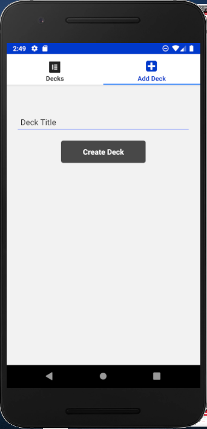
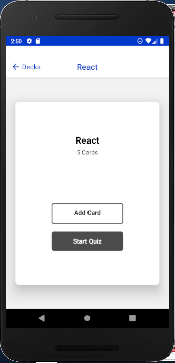
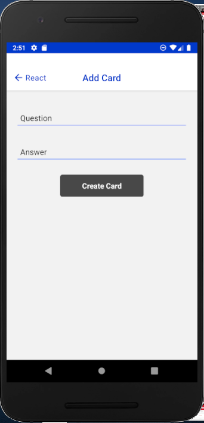
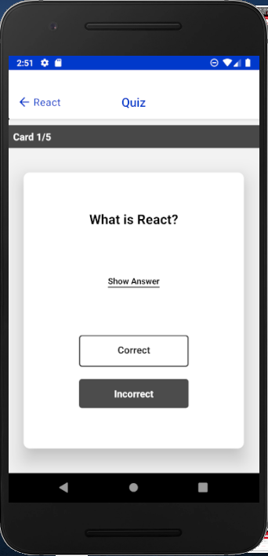
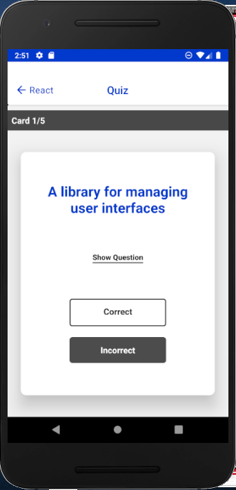
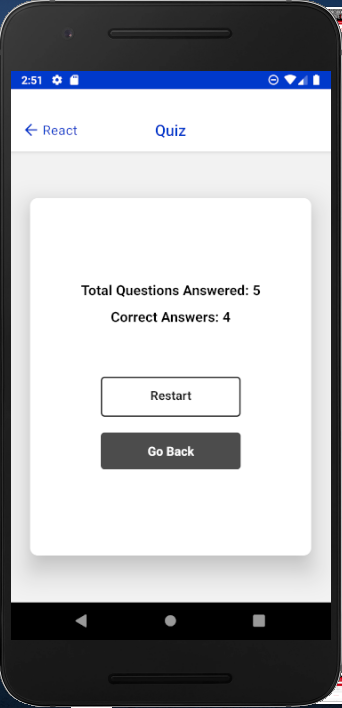
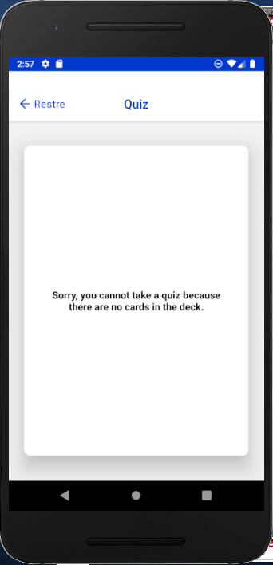

# Mobile-Flashcards
Udacity React Nanodegree final project - Mobile Flashcards App using React Native

## Author
This app was engineered and developed by Enyinna Inya.
- [@enyinnainya](https://github.com/enyinnainya)

### Project Description

Using React Native, I built an Android/iOS application that allows users to study collections of flashcards. This app uses AsyncStorage for local database; as well as Redux to manage app local state. The app will allow users to create different categories of flashcards called "decks", add flashcards to those decks called "questions or cards", then take quizzes on those decks. 
The application was fully tested on Android: Samsung Galaxy A30s. Due to the unavailability of an iOS phone, this app was not tested on iOS.

### Running the application

This application was built using [Expo](https://expo.io/) tool called 'create-react-native-app', as a result, you need NodeJS and NPM (or Yarn) to start it. To run the application on your Android device, download the Expo app from the Google Play Store and scan the QR code which is displayed in the command like window after running `yarn start`.

Also make sure you have the Expo-cli tool installed on your system for a smooth running/testing of this app.

 Run the following commands in your terminal to install and run/start this application:

`$ yarn install`

`$ yarn start`

or

`$ npm install`

`$ npm start`

#### Future improvements

- Keep running score of each deck or history of scores
- Edit / delete questions from card deck
- Swipe list item to edit / delete card decks

# Demo Screenshots
The following screenshots shows the different views/screens of this App as tested on Android (Samsung Galaxy A30s)

 

